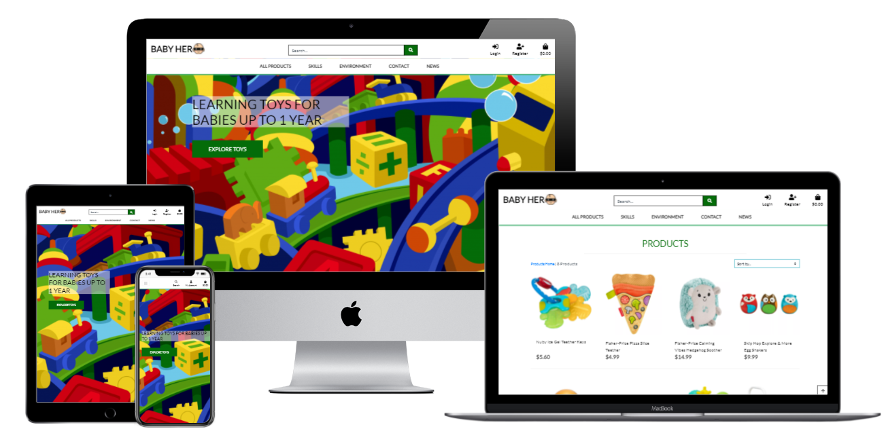
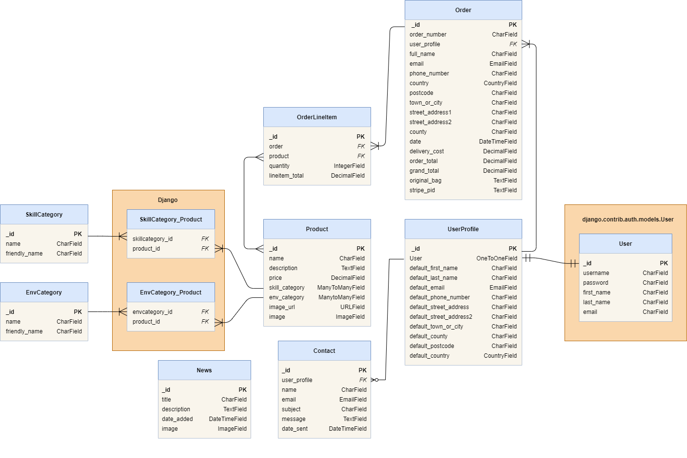

# MS4 Baby-Hero
Baby Hero is an e-commerce web store offering a wide range of toys & accessories for babies under 1 year old. It is a full-stack application that is designed to help customers understand the usage of the products and its functional purpose. It is possible for unregistered users to get to know all the products in stock and purchase them with ease. Additionally, customers can register their profiles, save their personal information for faster checkout process and view order history. There is a news feed that broadcasts latest store updates for all the visitors of the site. Also users have a possibility to contact webshop administration with a help of a special contact form provided on the site.



[Live Website](https://baby-hero.herokuapp.com/)

## Table of Contents

1.  <a  href="#ux">**User Experience (UX)**</a>
    * <a  href="#userstories">**User Stories**</a>
    * <a  href="#strategy">**Strategy and Scope**</a>
    * <a  href="#structure">**Structure**</a>
    * <a  href="#skeleton">**Skeleton**</a>
    * <a  href="#surface">**Surface**</a>

2.  <a  href="#features">**Features**</a>

3.  <a href="#database">**Database**</a>

4.  <a  href="#technologies">**Technologies**</a>

5.  <a  href="#testing">**Testing**</a>
    * <a  href="#knownbugs">**Known Bugs**</a>

6.  <a  href="#deployment">**Deployment**</a>
    * <a  href="#deploy-heroku-aws">**Heroku & AWS**</a>
        * <a  href="#deploy-heroku">**Heroku**</a>
        * <a  href="#deploy-aws">**AWS**</a>
        * <a  href="#deploy-stripe-email">**Stripe & Email**</a>
    * <a  href="#deploy-gitpod">**Gitpod**</a>   

7. <a  href="#credits">**Credits**</a>


<span  id="ux"></span>

# User Experience (UX)

<span  id="userstories"></span>

## User Stories

### As a user I would like to:

#### Navigation
- Easily understand the purpose of the website so that I can decide if it is relevant to me
- Have simple and self-explanatory navigation tools so that I can find products fast
- View multiple amount of products at once so that I can compare them and quicker choose the one I need
- View each product separately so that I can share a link to the product with others
- Be able to sort products by price so that I can easily compare product prices and find the cheapest products quicker
- Be able to filter products by type of environment where they are reccommended to be used so that I can make right decisions based on my needs
- Get responsive feedback from the web store on my actions so that I am aware of correctness of my actions.

#### User account
- Register an account so that I can have my personal account
- Login and logout so that I can easily access my personal information
- Recover my password so that I can get access to my personal account in case pasword was forgotten
- Receive an email after registration so that I can be sure that my account was registered successfully
- Have my personal profile page so that I can manage my payment/billing information and view order history

#### Shopping bag
- Be able add products to shopping bag so that I can make a purchase when I am ready
- See an overview of all added products so that I can make sure that I did everything correct
- Modify quantity and remove products in my shopping bag so that I can make corrections to my order before making a payment
- Add delivery information so that I can recieve products to the specified address after making a payment

#### Payment and checkout
- Make a payment for products that are in my shopping bag so that I can recieve chosen products to the specified address
- Recieve a confirmation email with all of the order details so that I can have all the required information in case if emergency


#### News and Contact
- Contact the store owners so that I can leave my feedback/suggestion/complaint regarding my expierence using the site
- Be able to read latest updates from store admins so that I can be aware of all the latest news

### As a store owner I would like to:

- Add/modify/delete products so that I can be flexible and manage products that are avaialbe for purchase on the site
- Add/modify/delete news articles so I can update customers with any important information
- Read messages submitted by contact form so that I can act on cutomer's feedback appropriately.

<span  id="strategy"></span>
### Strategy and Scope

There is a huge amount of toy shop out there, both online and physical ones. Most of them have a very broad spectrum of products for all kind of usages and ages. It can get very confusing when you look for something specific, especially if you just became a parent or want to buy something as a present. That's why I saw a need to start a store specifically with products for babies under 1 year old, because it is not 100% clear what toys & accessories are fit for such fragile children. In addition I came up with an unusual categories for such shop, that would filter products by baby's skills and environment where products can be used.

The website has clear and simple design that allows users to quickly navigate and search the products. While adding products to a shopping bag the total cost will update dynamically and the user can easily track his upcoming expenses. Afterwards the user can procced to the check-out page where he can make a payment and complete an order. The order confirmation & details will be sent to the user's email.

Website admins (or superusers) has access to extended rights & functionality: manage products, news blog and contact requests. 

<span  id="structure"></span>
### Structure

The website will be made up of multiple pages based on 8 data models, product, 2 kinds of categories, bag, checkout, user profile, contact form and news.
The landing page will consist of a large hero image with a text introduction of the site and suggestion to start shopping. 
Login, registration, add/edit products/profile/contact/news and contact pages will all consist of forms with varying inputs dependant on the purpose of the form. 
The profile page will display user information from the form and latest orders. 
The products page will display all products and can be sorted or filtered by price, by category. 
The category of products page will display all products by the catgory and can be sorted or filtered by price, by category. 
The product detail page will display the image and details with an option to purchase, edit/delete for the admin user. 
The news page will display all latest news about the webshop with an option to add, edit/delete for the admin user. 
The contact page will display form for contacting the webshop administration.
The bag page will display items in the bag, subtotals, delivery cost, grand total and an option to update quantities in the bag. 
The checkout page will display and order summary, a user information form and stripe inputs. 
The successful checkout page will display an order summary and a message stating the summary has been emailed to the address provided. 

<span  id="skeleton"></span>
### Skeleton

Mockup of the website was created in ["Balsamiq Wireframes"](README_files/wireframes.pdf).

<span  id="surface"></span>
### Surface

The primary design goal is to attract the user to explore the application. The landing page is bright and striking with a call-to-action button leading users to the shop. Bright design represents atmoshpere of the shop with colorful pictures of children products.
It's a visually appealing application, designed an intuitive and easy to navigate website. 
The website is responsive on all screen sizes, using Bootstrap4 features. 

The design of logo is created by myself that is simple, fun and memorable.  
 

The colour scheme chosen for this project was inspired by warm bright colours of children products to give the website an attractive, fresh look. To balance and harmonize bright colors the white background is chosen. It gives a neutral look to the website with green and black nicely complementing.


* #FFFFFF White is the background of all pages on the website. The bright colour and the black text is easily readable on the white background. 
* #046c09 Green is used for for headings and some buttons seen throughout the website and dilutes the black and white palette. 
* #000000 Black is used for text and icons on the website. The black text is easily read on the white background. Black is also used throughout the application for buttons.

The font-family "Lato" is used because of classical proportions to give the letterforms familiar harmony and elegance. The semi-rounded details of the letters give Lato a feeling of warmth with the feeling of the Summer.

<span  id="features"></span>

## Features

### Existing features

#### General

1. Navigation bar on top of each page that consists of:
    * Site logo
    * Search bar
    * Main manvigation menu
    * Menu entries to Login/Register for anonymous users
    * My Account menu entry with a dropdown sub menu for authorized users
    * Shopping bag menu entry with a total amount displayed
2. Responsive layout that is adapted to desktop and mobile screen sizes.
3. Supported by all of the most popular web browsers.
4. Instant feedback from the site to the user with the help of pop-up messages when important actions take place.

#### User can:
1. View multiple products on single page.
2. View each product on separate page.
3. Search box where products can be found by name or description.
4. Sort products by price, name and categories, both ascending and descending.
5. Filter products by categories.
6. Add product to the shopping bag with specified quantity.
7. View shopping bag.
8. Update quantity or Remove product(s) from the shopping bag.
9. View checkout page.
10. Submit delivery information and payment details on checkout page.
11. Complete an order and make a payment.
12. View order details on payment completion.
13. Receive an email with order details on payment completion.
14. View latest news and updates from the store owners.
15. Contact store owners directly from the website.
16. Register or Login to private user account.

#### Authorised User can:
1. View My Profile page
2. Update personal delivery information that will be used to prefill checkout form
3. View order history
4. Logout from the site

### Site Administrator can: 
1. Execute all the feautures of an authorised user mentioned above.
2. Add new product(s) to the site.
3. Modify or delete existing products on the site.
4. Add new News Articles to the site.
5. Modify or delete existing News Articles on the site.
6. View contact forms submitted by users.

<span  id="technologies"></span>
## Technologies

<span  id="Database"></span>
### Database 

Database design is shown on the picture below:



- Models with orange background are coming from Django and its libraries
- I decided to have two separate models for two different types of categories.
- Also each product can have several categories of each type. That makes it more flexible and more engaging for customers to explore different products. Also it is more correct that some products for example can be used both indoor and outdoor (multiple environment categories) and can be used both for teething and touching (multiple skill categories).

### Languages used:

- HTML5 - for basic content and structure of the website.  
- CSS3 - for style the website.  
- Javascript - for interactivity throughout website.  
- Python - for handle backend functionality.  

### Frameworks and libraries used:
[Django](https://www.djangoproject.com/) - Python Web framework that encourages rapid development and clean, pragmatic design.  
[Bootstrap4](https://getbootstrap.com/) - front-end framework for faster and easier web development including forms, buttons and navigations.  
[Stripe](https://stripe.com/en-gb-se)- payment processing software and application programming interfaces for e-commerce websites and mobile applications.  
[Django Allauth](https://django-allauth.readthedocs.io/en/latest/installation.html) - an integrated set of Django applications addressing authentication, registration and account management.  
[JQuery](https://jquery.com/) - for making the site interactive.  
[Font Awesome](https://fontawesome.com/) - for using icons.  
[Google Fonts](https://fonts.google.com/) -  for font of the website.  
[Balsamiq](https://balsamiq.com/) - for creating the wireframe. 


### Tools and Other Resources used:

[Github](https://github.com/) - for version control and store the code for the project.   
[Gitpod](https://www.gitpod.io/) - for writing the code for the website and push it to Github.    
[Heroku](https://id.heroku.com/login) – for deployment the project.  
[Werkzeug](https://werkzeug.palletsprojects.com/en/2.0.x/) - for verifying the hashed password and username.    
[Mockup generator](http://techsini.com/multi-mockup/index.php) - for testing responsive website on various devices.  
[W3 Schools](https://www.w3schools.com/) - for HTML, CSS, JS, Python tips.  
[Stackoverflow](stackoverflow.com) - for finding answers on questions.  
[Webformatter](https://webformatter.com) - for beautifying HTML, CSS, Javascript codes.  
[Datetime](https://docs.python.org/3/library/datetime.html#module-datetime) - for manipulating dates and times. 


### Codes used:

Some of the code was taken from the sources:
* [Stackoverflow](https://stackoverflow.com/) - 
* [CodeInstitute course]() – 

<span  id="testing"></span>

## Testing

For testing this project I used several different approaches:
 - Automatic testing using Django test framework
 - Manual Testing
 - Testing using external tools

### Automatic testing

For each app in the project there are test_views.py and test_forms.py files. In order to run for each app use:
```
python3 manage.py test <app_name>
```

Or run it without <app_name> if you want to run tests for the whole project

#### test_views.py

Here we test our request -> response logic and it is done for three different roles : Anonynous user, Authenticated user and Superuser (admin).
For example we shouldn't be able to access order history of other user by typing in existing order id in url.

#### test_forms.py

In apps where we have forms we test required and non-required form fields mainly.


### Manual testing

With manual testing we use existing <a  href="#userstories">User Stories</a> and <a  href="#features">Features</a> to ensure that all required functionality works correctly and requirements are met.

#### User Stories
| Story                                                                                    	| Action                                                                                                                                                                                                                                                                                                                                                                                                                                                                                                                                                                                                                                                                                                            	| Result 	|
|------------------------------------------------------------------------------------------	|-------------------------------------------------------------------------------------------------------------------------------------------------------------------------------------------------------------------------------------------------------------------------------------------------------------------------------------------------------------------------------------------------------------------------------------------------------------------------------------------------------------------------------------------------------------------------------------------------------------------------------------------------------------------------------------------------------------------	|--------	|
| **User**                                                                                     	|                                                                                                                                                                                                                                                                                                                                                                                                                                                                                                                                                                                                                                                                                                                   	|        	|
| Easily understand the purpose of the website                                             	| Website name mentions babies, website logo has a baby face, homepage has clear message what webshop offers, background with toys supports this message.                                                                                                                                                                                                                                                                                                                                                                                                                                                                                                                                                           	| PASSED 	|
| Have simple and self-explanatory navigation tools                                        	| User-friendly navigation bar that is similar to a lot of web pages. It exists on all the pages and stays on top when navigating the shop. Colors clearly very visible.                                                                                                                                                                                                                                                                                                                                                                                                                                                                                                                                            	| PASSED 	|
| View multiple amount of products at once                                                 	| All menu entries that lead to showing products open a page with a grid with multiple product items.                                                                                                                                                                                                                                                                                                                                                                                                                                                                                                                                                                                                               	| PASSED 	|
| View each product separately                                                             	| Clicked on random product image. A separate page opened for that product. Copied the URL, tried to use that URL on different device. Page with same product opened.                                                                                                                                                                                                                                                                                                                                                                                                                                                                                                                                               	| PASSED 	|
| Be able to sort products by price                                                        	| On "All Products" page clicked on "Sort by..." -> "Price (low to high)" and "Price (high to low)". Verified that products got sorted correctly.                                                                                                                                                                                                                                                                                                                                                                                                                                                                                                                                                                   	| PASSED 	|
| Be able to filter products by type of environment where they are reccommended to be used 	| Menu items in main navigation bar "Skills" and "Environment" open dropdowns with all available categories. Opened a random category of each category set. Verified that only products of one category was opened.                                                                                                                                                                                                                                                                                                                                                                                                                                                                                                 	| PASSED 	|
| Get responsive feedback from the web store on my actions                                 	| There are notification messages appear when I login/logout, update my shopping bag, enter faulty information etc.                                                                                                                                                                                                                                                                                                                                                                                                                                                                                                                                                                                                 	| PASSED 	|
| Register an account                                                                      	| Clicked on "Register" icon and on top right corner. Filled in the form, clicked "Sign Up" and got a message that verification email was sent to my email.                                                                                                                                                                                                                                                                                                                                                                                                                                                                                                                                                         	| PASSED 	|
| Login and logout                                                                         	| Clicked "Login" icon on top right corner. Logged in with my credentials. Clicked on "My Account" -> "Logout". Sighed out successfully.                                                                                                                                                                                                                                                                                                                                                                                                                                                                                                                                                                            	| PASSED 	|
| Recover my password                                                                      	| Clicked "Forgot Password" on login page. Followed instructions provided afterwards. Successfully changed my password and logged in with new credentials.                                                                                                                                                                                                                                                                                                                                                                                                                                                                                                                                                          	| PASSED 	|
| Receive an email after registration                                                      	| Received an email with a verification link. Clicked "Confirm" on the page provided with a link.                                                                                                                                                                                                                                                                                                                                                                                                                                                                                                                                                                                                                   	| PASSED 	|
| Have my personal profile page                                                            	| After logging in clicked in "My Account" -> "My Profile". Got My Profile page.                                                                                                                                                                                                                                                                                                                                                                                                                                                                                                                                                                                                                                    	| PASSED 	|
| Be able add products to shopping bag                                                     	| Searched for a product. Opened single product page. Clicked "Add to bag". Received a message on top right corner that product was added to the bag. The product was added to the bag.                                                                                                                                                                                                                                                                                                                                                                                                                                                                                                                             	| PASSED 	|
| See an overview of all added products                                                    	| Clicked on bag icon on top right corner. Shopping bag page opened with an overview of all products added to the bag.                                                                                                                                                                                                                                                                                                                                                                                                                                                                                                                                                                                              	| PASSED 	|
| Modify quantity and remove products in my shopping bag                                   	| In a shopping bag with a product changed quantity and clicked "update". Information changed. Clicked "delete", product got removed from the shopping bag.                                                                                                                                                                                                                                                                                                                                                                                                                                                                                                                                                         	| PASSED 	|
| Add delivery information                                                                 	| After clicking "Secure checkout" in shopping bag got redirected to checkout page with a form where delivery information needs to be filled in.                                                                                                                                                                                                                                                                                                                                                                                                                                                                                                                                                                    	| PASSED 	|
| Make a payment for products that are in my shopping bag                                  	| After filling in delivery information form and payment details on checkout page clicked "Complete Order". Got a confirmation page with order details and a notification on top right corner notifying that confirmation email is sent.                                                                                                                                                                                                                                                                                                                                                                                                                                                                            	| PASSED 	|
| Receive a confirmation email with all of the order details                               	| Received an email with order details after completing the payment.                                                                                                                                                                                                                                                                                                                                                                                                                                                                                                                                                                                                                                                	| PASSED 	|
| Contact the store owners                                                                 	| Opened Contact form by clicking "Contact" menu item in main navigation menu. Filled in the form and clicked send. Got a notification on top right corner that my message got sent.                                                                                                                                                                                                                                                                                                                                                                                                                                                                                                                                	| PASSED 	|
| Be able to read latest updates from store admins                                         	| Clicked "News" menu. Read all the posts on a news page provided by admins.                                                                                                                                                                                                                                                                                                                                                                                                                                                                                                                                                                                                                                        	| PASSED 	|
| **Admin**                                                                                    	|                                                                                                                                                                                                                                                                                                                                                                                                                                                                                                                                                                                                                                                                                                                   	|        	|
| Add/modify/delete products                                                               	| Logged in as admin on the website. 1. Opened a page for adding product by navigating to "My profile" -> "Add product". 2. Filled in all required fields. Clicked "Add product". 3. A page with a newly added product opened. Clicked "Edit". 4. On edit product page changed description and price. Clicked "Update product". 5. Page with edited product opened. Verified that description and price got modified. 6. Clicked "Delete". Got redirected to all products page. Notification at top right corner said that the product was successfully deleted. Verified that it does not exist on all products page.                                                                                              	| PASSED 	|
| Add/modify/delete news articles                                                          	| Logged in as admin on the website. 1. Opened a page for adding news article by navigating to "My profile" -> "Add News Article". 2. Filled in all required fields. Clicked "Add News Article". 3. A page with a all news opened. Clicked "Edit" on newly added article. 4. On edit news page changed description and image. Clicked "Update News Article". 5. Page with all news opened. Verified that description and image got modified. 6. Clicked "Delete". Got a popup message that verifies that I really want to delete it Clicked "Yes". Got redirected to news page. Notification at top right corner said that the news article was successfully deleted. Verified that it does not exist on news page. 	| PASSED 	|
| Read messages submitted by contact form                                                  	| 1. Navigated to contact form page by clicking on "Contact" menu item. 2. Filled in all required fields. Clicked "Send".  Got a notification message on top right corner saying that the contact form was submitted successfully. 3. Opened Django administration panel. Logged in as admin. 4. Opened "Messages" under "Contact" app. 5. Verified that created contact message exist and I can see all the fields.                                                                                                                                                                                                                                                                                                	| PASSED 	|


#### Features
Some features got covered by user stories testing. That's why in the following table I skip testing same functionality.

| Feature                                                                                                                                                                                                                                                                         | Action                                                                                                                                                                                                                                                                     | Result |
|---------------------------------------------------------------------------------------------------------------------------------------------------------------------------------------------------------------------------------------------------------------------------------|----------------------------------------------------------------------------------------------------------------------------------------------------------------------------------------------------------------------------------------------------------------------------|--------|
| Navigation bar on top of each page that consists of site logo, search bar, main navigation menu, menu entries to login/register for anonymous users, my account menu entry with a dropdown sub menu for authorized users, shopping bag menu entry with a total amount displayed | Clicked through all site pages, the menu exists with all functionality described                                                                                                                                                                                           | PASSED |
| Responsive layout that is adapted to desktop and mobile screen sizes.                                                                                                                                                                                                           |                                                                                                                                                                                                                                                                            |        |
| Supported by all of the most popular web browsers.                                                                                                                                                                                                                              |                                                                                                                                                                                                                                                                            |        |
| Instant feedback from the site to the user with the help of pop-up messages when important actions take place.                                                                                                                                                                  | Notification messages on top right corner are informing the user through login/logout process, when any form is successfully processed or not, when doing modifications to shopping bag, when doing payments etc.                                                          | PASSED |
| Search box where products can be found by name or description.                                                                                                                                                                                                                  | Typed partly name of a random product. Clicked "Search". The products was found. Typed in part of random product description. Clicked "Search". Searched product was found.                                                                                                | PASSED |
| Sort products by price, name and categories, both ascending and descending.                                                                                                                                                                                                     | Tried all possible options in Sort dropdown on products page. Verified that sorting is done correct.                                                                                                                                                                       | PASSED |
| Filter products by categories.                                                                                                                                                                                                                                                  | Used "Skill" and "Environment" menu entries to select specific products category. Verified that products of selected category are shown.                                                                                                                                   | PASSED |
| Add product to the shopping bag with specified quantity.                                                                                                                                                                                                                        | Opened a product detail page of a random product. Clicked "Add to bag". Notification message told that the product was added to the shopping bag. Total bag amount in top right corner got updated.                                                                        | PASSED |
| View shopping bag, update quantity or remove product(s) from the shopping bag.                                                                                                                                                                                                  | Opened shopping bag view by clicking on the bag icon in top right corner with two products in it. Shopping bag page opened with products overview. Increased the quantity by 1 by clicking "+" sign and "update" of first product. Clicked "delete" for a second product.  | PASSED |
| View checkout page, submit delivery information and payment details on checkout page.                                                                                                                                                                                           | Clicked "Secured Checkout" in shopping bag with products in it. Filled in all required fields including personal, delivery and payment infromation.                                                                                                                        | PASSED |
| Complete an order and make a payment. View order details on payment completion.                                                                                                                                                                                                 | Clicked "Complete Order" on checkout page. Got redirected on the page with order details and a message that same order details were sent to my email.                                                                                                                      | PASSED |
| Receive an email with order details on payment completion.                                                                                                                                                                                                                      | Received and email on the specified email address after making a payment.                                                                                                                                                                                                  | PASSED |
| Register or Login to private user account, logout from the site                                                                                                                                                                                                                 | Registered an account. Logged in. Logged out. Everything worked correctly.                                                                                                                                                                                                 | PASSED |
| View My Profile page / order history                                                                                                                                                                                                                                            | While logged in opened My Profile page in "My Profile" menu. Viewed my personal information and past orders that I have done.                                                                                                                                              | PASSED |
| Update personal delivery information that will be used to prefill checkout form                                                                                                                                                                                                 | On my profile page filled in some fields regarding my personal information, clicked "Update information". Then tried to make a purchase and verified that same information gets prefilled in the checkout page.                                                            | PASSED |

### Testing using external tools

For testing general code style formatting I used several libraries and tools:

#### Python
[Flake8](https://flake8.pycqa.org/en/latest/) libary was used to reformat code and fix minor issues.
Run it with a follwing command in the terminal:
```
python -m flake8
```
I haven't fixed some warnings for example in migration files where the code is autogenerated. Also in _settings.py_ some lines were too long because of very long library names.
I added special flake comments to ignore such warnings in whole files or specific lines. You can read more about ignore comments [here](https://flake8.pycqa.org/en/3.1.1/user/ignoring-errors.html).

#### CSS
CSS is tested by [The W3C CSS Validation Service](https://jigsaw.w3.org/css-validator/). No errors are found. There are only warnings regarding bootstrap libraries.

#### HTML
HTML is tested by [Nu Html Checker](https://validator.w3.org/nu/). All pages were tested, no errors & warnings found.


#### Javascript
Javascript was validated by [JSHint](https://jshint.com/). There was a warning on multiple scripts

```
'template literal syntax' is only available in ES6 (use 'esversion: 6')
```

As a suggested fix I added _.jshintrc_ file in root directory with the following content:
```
{
    "esversion": 6
}
```


<span  id="knownbugs"></span>
### Known Bugs

<span  id="deployment"></span>
## Deployment

<span  id="deploy-heroku-aws"></span>
### Heroku & AWS
Instructions below describe how to deploy this project using Heroku and Amazon Web Services (AWS).

Prerequisits:

- Clone the repository and have the command line ready.
- There are some dependencies that are specifically required for deploying an app to Heroku. In order to prevent any errors during deployment process install all libraries in requirements.txt file:
```
pip install -r requirements.txt
```

This deployment process is designed to use fixtures in order to load data to the database.
You should update JSON files in _fixtures/_ directory with your own custom data if required.

<span  id="deploy-heroku"></span>
#### Heroku

##### Create Heroku app
1. Create an account [here](https://www.heroku.com/) and login.
2. Start creating new application by clicking _New -> Create new app_.
3. Give the app a unique name using lowercase letters, numbers and dashes.
4. Choose a region closest to you.

##### Create Heroku Database
5. Switch to _Resources_ tab, use _Add-ons_ search field to find _Heroku Postgress_ addon and select it.
6. Select a plan that fits you and proceed by clicking confirmation button.

##### Load data to Heroku Database
7. Run the following command in your terminal to avoid possible known problem before proceding to the next step:
```
unset PGHOSTADDR
```
8. We should temporarily make a change in _setting.py_ in order to load data from local environment to Heroku database:
In settings.py change a piece of code from:
```python
  if 'DATABASE_URL' in os.environ:
    DATABASES = {
        'default': dj_database_url.parse(os.environ.get('DATABASE_URL'))
    }
    else:
    DATABASES = {
        'default': {
            'ENGINE': 'django.db.backends.sqlite3',
            'NAME': os.path.join(BASE_DIR, 'db.sqlite3'),
        }
    }
```

	to:

```python
  DATABASES = {
    'default': dj_database_url.parse(_<your_db_url>_)
  }
```
_<your_db_url>_ you can find in Config Vars under "Settings" tab at your Heroku dashboard.

9. Run the following command to make sure that everything is set up correctly. You should see a printed list of apps and migration script name:"
```
python3 manage.py showmigrations
```
10. Run the following command to apply migrations and set up a database:
```
python3 manage.py migrate
```
11. Load data to the database from fixtures by running following commands in this specific order (products depend on categories):
```
python3 manage.py loaddata skill_categories
python3 manage.py loaddata env_categories
python3 manage.py loaddata products
python3 manage.py loaddata news
```
12. Create superuser (admin) for your app by running the following command and follow instructions in the console:
```
python3 manage.py createsuperuser
```
13. Revert the changes made in step #8 in _settings.py_

##### Add Config Vars to Heroku
14. Go to _Setting_ tab on your Heroku dashboard and click _Reveal Config Vars_ in _Config Vars_ section. Add following variables:
  * DISABLE_COLLECTSTATIC = 1 (disabling collecting static files by Heroku, we will remove it later)
  * SECRET_KEY = _<generated_key>_
  _<generated_key>_ you can get [here](https://miniwebtool.com/django-secret-key-generator/)

##### Last steps

15. Add name of your Heroku app to ALLOWED_HOSTS list in _settings.py_.
16. Login to Heroku via command line:
```
heroku login
```

or without opening a browser

```
heroku login -i
```
17. Initialize Heroku git remote for your app:
```
heroku git:remote -a <name_of_your_app>
```
18. Push the app to Heroku:
```
git push heroku master
```

or

```
git push heroku
```

At this point you are finished setting up Heroku app.

##### (Optional) Set automatic deployment to Heroku on every push to GitHub:
19. On you Heroku Dashboard go to _Deploy_ tab choose _Deployment method GitHub_ and choose your repository to connect.
20. Once connected click _Enable Automatic Deploys_.

<span  id="deploy-aws"></span>
#### Amazon Web Services (AWS)

AWS is used to host static and media files.

##### Create S3 Bucket
1. Create account [here](https://aws.amazon.com/).
2. Login to your _AWS Management Console_.
3. In search box type _S3_ and select _S3_ (Scalable Storage in the Cloud).
4. Click _Create Bucket_.
5. Type in a bucket name and select closest region to you.
6. Uncheck _Block all public access_ checkbox and check _I aknowledge.._ popup message.
7. Click _Create bucket_.

##### Configure S3 Bucket
8. Open your newly created bucket dashboard, go to _Properties_ tab and select to edit _Static website hosting_ option.
9. Select option to host a static website, fill in default values like _index.html_/_error.html_ (we will not use them).
10. Click _Save_
11. Navigate to _Permissions_ tab -> _Cross-origin resource sharing (CORS)_ and add following configuration:
```
[
  {
      "AllowedHeaders": [
          "Authorization"
      ],
      "AllowedMethods": [
          "GET"
      ],
      "AllowedOrigins": [
          "*"
      ],
      "ExposeHeaders": []
  }
]
```
12. Navigate to _Permissions_ tab -> _Bucket Policy_, 
13. Save _Bucket ARN_ somewhere. You will need it several times in the future during this instructions.
14. Navigate to _Edit_ -> _Policy Generator_:
   * Type of Policy - S3 Bucket Policy
   * Principal - \* 
   * Actions - GetObject
   * Amazon Resource Name (ARN) - Bucket ARN from step #13
13. Click _Add Statement_, then _Generate Policy_, copy configuration settings from the popup window
14. Paste those settings to the Bucket Policy editor and add _/*_ in the end of _Resource_ key, click save.
15. Navigate to _Permissions_ tab -> _Access Control List_, check _List_ objects to _Everyone (public access)_, click _Save_.

##### Set user with Identity and Access Management (IAM)

Create Group and attach Policy

16. In your AWS Management Console in search box type _IAM_ and select _IAM_.
17. Create new user group.
18. Click _Policy_ -> _Create Policy_.
19. Change to JSON tab, click _Import managed policy_
20. Search for _S3FullAccess_ policy and import it.
21. Change _\*_ for _Resource_ key to _["<your_bucket_arn>", "<your_bucket_arn>*"]_ (<your_bucket_arn> from step #13).
22. Click _Review Policy_, give it a name/description and create policy.
23. Go to your user group created earlier and under _Permissions_ tab attach a policy you just created.

Create User

24. Go to _Users_ -> _Add User_.
25. Give user a name and select _Programmatic Access_, click _Next_.
26. Add a user to the group created above.
27. Click _Create User_.
28. Download and save .csv file with user credentials.
29. Add following Config Vars to your Heroku app and use data from the file downloaded in previous step:
  * AWS_ACCESS_KEY_ID = <access_key_id>
  * AWS_SECRET_ACCESS_KEY = <secret_access_key>

##### Last Steps
30. Add following Config Var to your Heroku app:
  * USE_AWS = True
31. Remove DISABLE_COLLECTSTATIC Config Var from your Heroku app.
32. In _settings.py_ update AWS_STORAGE_BUCKET_NAME parameter with your bucket name.
33. Go to your AWS Bucket dashboard and create media/ folder.
34. Upload all of your images to that folder. Choose _Grant public read access_ under _Permissions_.

<span  id="deploy-stripe-email"></span>
#### Stripe & Email

##### Stripe
1. Go to your Stripe account -> _ Developers_ -> _API Keys_.
2. In Heroku create following Config Vars and use API key information from Stripe:
  * STRIPE_PUBLIC_KEY = <public_key_from_stripe>
  * STRIPE_PRIVATE_KEY = <private_key_from_stripe>
4. Create new Webhook in Stripe using _<heroku_app_url>/checkout/wh/_ as an _Endpoint URL_. Select _Payment Intent_ events.
5. Add STRIPE_WH_SECRET Config Var in Heroku with webhook signing secret.

##### Email
This project supports gmail account configuration.
After you have all the settings set in your Gmail you need to add two Config Vars to Heroku:
  * EMAIL_HOST_USER: <your_email_address>
  * EMAIL_HOST_PASS: <password_generated_by_gmail>

<span  id="deploy-gitpod"></span>
### Gitpod

1. Fork this project to your Github user.
2. Go to profile settings on you gitpod accoint and click _Variables_.
3. Add following environment variables with scope _\*/\*_ : 
  * DEVELOPMENT = True
  * SECRET_KEY = _<generated_key>_

  _<generated_key>_ you can get [here](https://miniwebtool.com/django-secret-key-generator/)

  * STRIPE_PUBLIC_KEY = <public_key_from_stripe>
  * STRIPE_PRIVATE_KEY = <private_key_from_stripe>
  * STRIPE_WH_SECRET = <secret_wh_from_stripe>

   More infromation about stripe variables [here](#deploy-stripe-email)

4. Navigate to _www.gitpod.io#<full_url_to_github_project>_ , this will initiate creating Gitpod workspace for your repo.
5. Once workspace is created install all the dependencies:
```
pip install -r requirements.txt
```

6. Apply all migrations and load data using following commands:
```
python3 manage.py showmigrations
python3 manage.py migrate
python3 manage.py loaddata skill_categories
python3 manage.py loaddata env_categories
python3 manage.py loaddata products
```
7. Create superuser (admin) for your app by running the following command and follow instructions in the terminal:
```
python3 manage.py createsuperuser
```
8. Run the app using following command and click _Open Browser_ once it is running:
```
python3 manage.py runserver
```

<span  id="credits"></span>
## Credits

### Contents

All content is written by developer Darya Belarusik.

### Media

Image for background, product images were taken from:


Logo of the website in navigation menu is created by Darya, using the image from the source [freedesignfile.com](https://freedesignfile.com/367673-baby-hero-logo-vector/)

### Acknowledgements

Inspiration for this project was received from:
* Other code institute students' projects.
* Help of the mentor, slack and my husband.
